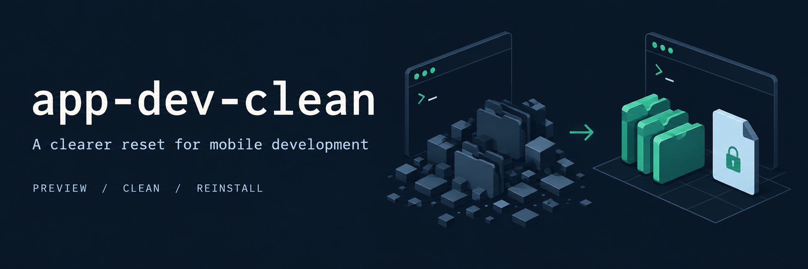
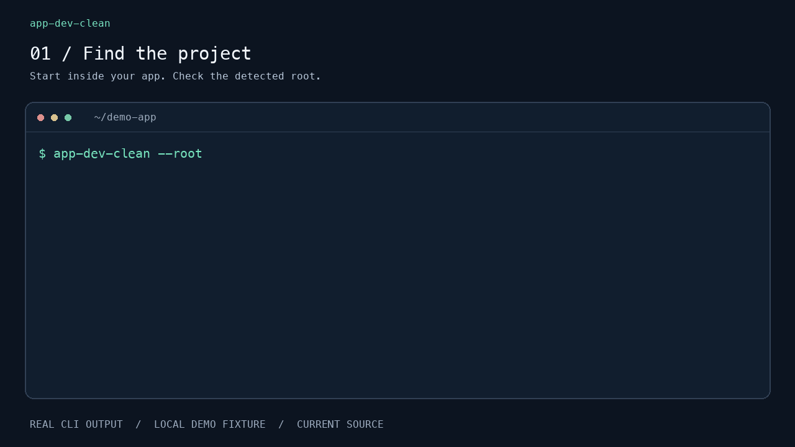

# app-dev-clean

**Preview the reset. Clean selected caches. Keep your lockfiles.**



[](https://github.com/latif-essam/app-dev-clean/actions/workflows/ci.yml)
[](https://github.com/latif-essam/app-dev-clean/releases/latest)
[](LICENSE)

A terminal tool for the cleanup steps you keep looking up: `node_modules`,
Metro caches, Android build output, Pods, Flutter artifacts, and more.
One Go binary for **macOS, Linux, and Windows**, with project detection,
an interactive checklist, and commands you can run directly.

[Install](#install) · [Watch the walkthrough](#see-it-work) · [First cleanup](#your-first-cleanup) · [Command reference](docs/usage.md) · [Roadmap](docs/roadmap.md)

> **Release status:** the latest published package is `v0.1.0`. The walkthrough
> and behavior below describe the newer source on `main`, including lockfile
> preservation, locked reinstalls, and shared-cache safeguards. These changes
> are **not yet in Homebrew, Scoop, or installs from the latest published Go tag**.
> [Build the current source](docs/install.md#build-the-current-source) to try them
> now, or follow the [changelog](CHANGELOG.md) for the next release.

## Why use it?

Cache troubleshooting often becomes a long command copied from an old note.
app-dev-clean brings those operations into one place and makes their scope visible.

- **Find the right project.** Run from a supported project or one of its subdirectories.
- **Inspect before deleting.** `--dry-run` lists paths, commands, and estimated file sizes.
- **Choose the scope.** Local targets are separate from caches shared by other projects.
- **Reinstall deliberately.** Keep the lockfile and use the detected package manager.
- **See what is happening.** Cleanup steps, subprocess output, and warnings stay in your terminal.

This helps reset development state when you suspect stale artifacts. It does
not diagnose build errors or guarantee that cleaning will fix them.

## See it work



*Actual CLI and npm output from `dev-6371ead`, rendered for readability. A tiny
local demo dependency exercises the install flow without registry downloads.
Paths are shortened and playback is paced; this is not a speed benchmark or a full
Expo app installation.*

[Still image](docs/media/preview.png) · [Text tutorial](docs/quickstart.md) · [Capture details](docs/media/README.md)

## Install

Choose the route for your machine. Package installs below currently provide
**v0.1.0**; use the source-build instructions above for the new behavior.

### macOS

With [Homebrew](https://brew.sh/) installed:

```sh
brew install latif-essam/tap/app-dev-clean
app-dev-clean --version
```

Supports Apple Silicon and Intel release binaries. This is the project's own
tap; the package is **not in `homebrew/core`**. To include the tap in your local search:

```sh
brew tap latif-essam/tap
brew search app-dev-clean
```

### Linux

With [Homebrew on Linux](https://docs.brew.sh/Homebrew-on-Linux):

```sh
brew install latif-essam/tap/app-dev-clean
app-dev-clean --version
```

Without Homebrew, use a [Linux release archive](docs/install.md#manual-installation)
for x86-64 or ARM64, or the Go install below. WSL uses the Linux installation route.

### Windows

With [Scoop](https://scoop.sh/) installed, run in PowerShell:

```powershell
scoop bucket add latif-essam https://github.com/latif-essam/scoop-bucket
scoop install app-dev-clean
app-dev-clean --version
```

Without Scoop, use a [Windows release ZIP](docs/install.md#manual-installation)
for x86-64 or ARM64. The CLI runs in PowerShell or Windows Terminal;
it does not require Bash. Xcode and CocoaPods workflows require macOS.

### Any platform with Go

With [Go](https://go.dev/doc/install) installed:

```sh
go install github.com/latif-essam/app-dev-clean@latest
app-dev-clean --version
```

Ensure Go's binary directory is on `PATH` (normally `$HOME/go/bin` on macOS/Linux
or `%USERPROFILE%\go\bin` on Windows). `GOBIN` or a custom `GOPATH` can change it.

Homebrew and Scoop also provide the short `adc` alias. Go builds and raw release
archives use `app-dev-clean`. [Manual install, updates, removal, and PATH help →](docs/install.md)

## Your first cleanup

**For the current source build.** Open a terminal inside your app's project folder,
then preview one target:

```sh
app-dev-clean --root
app-dev-clean js --reinstall --dry-run -y
```

For a React Native or Expo app, this previews removal of `node_modules` and the
locked install command. Review the paths, then run the same operation without
`--dry-run` when ready:

```sh
app-dev-clean js --reinstall -y
```

For the interactive checklist, preview your selection with:

```sh
app-dev-clean --dry-run
```

| Key | Action |
| --- | --- |
| `↑` / `↓` or `j` / `k` | Move between targets |
| `Space` | Toggle a target |
| `a` | Select project-local targets only |
| `n` | Clear the selection |
| `Enter` | Execute the selection, or preview it with `--dry-run` |
| `q` / `Ctrl+C` | Quit |

Run `app-dev-clean` without `--dry-run` for an actual cleanup. `-y` skips prompts;
it does **not** imply reinstall. Add `--reinstall` explicitly when needed.

## What can I clean?

| Project | Common targets | Examples of affected files |
| --- | --- | --- |
| React Native | `js`, `android`, `ios`, `metro`, `watchman` | Dependencies, native build output, Metro caches |
| Expo | `js`, `expo`, `metro`; native targets when present | `node_modules`, `.expo`, `.expo-shared` |
| Flutter | `flutter` | `build`, `.dart_tool`, plus `flutter clean` |
| Native Android | `android` | `build`, `app/build`, `.gradle`, `.cxx` |
| Xcode / SwiftPM | `ios` | `build`, `Pods`, `.build` |

`local-all` selects project-local targets. Metro is shared and is excluded.
Global targets include `gradle-global`, `xcode-dd`, `pods-cache`, and `pub-cache`.
Shared/global cleanup requires confirmation or explicit `--allow-shared` with `-y`.
The broad `nuclear` option is documented in the [command reference](docs/usage.md).

## Lockfiles, caches, and boundaries

For automatic reinstalls, the current source selects npm, pnpm, Yarn, or Bun from
the project metadata and lockfiles. npm uses `npm ci --prefer-offline`; other
managers use their locked-install options. CocoaPods uses deployment mode and
Bundler when declared. [Exact commands →](docs/usage.md#reinstallation)

- Local cleanup preserves dependency lockfiles and package download caches.
- Existing download caches are reused where possible; missing packages may still need network access.
- Invalid selections, unsafe paths, tracked files in cleanup folders, and ambiguous install plans stop the operation before deletion.
- Shared-workspace JS resets are refused; use the workspace's package manager directly.
- Command failures stop execution and return a nonzero status.

**Deletion is real:** untracked files in selected output folders are removed.
There is no undo or backup feature. External tools and package lifecycle scripts
run with their own behavior and permissions. If reinstall fails, dependencies
may remain missing; the CLI reports the command to retry. Read the
[full safety boundaries](docs/usage.md#safety-and-limits) before broad cleanup.

## Help shape the next release

Try a dry-run on a project you know and [report unexpected paths or behavior](https://github.com/latif-essam/app-dev-clean/issues).
Include your OS, CLI version, project type, package manager, command, and relevant
output with private paths and credentials removed.

Useful next steps are [listed in the roadmap](docs/roadmap.md): a packaged release
of the safety fixes, installation checks on fresh machines, and more real-project
feedback. If the tool is useful to you, a star helps others find it. Bug reports
and small, tested contributions are welcome too.

## Development

Go 1.24 or newer is required to build the current source.

```sh
go test ./...
go vet ./...
go build -o dist/dev/app-dev-clean .
```

Use an `.exe` output name on Windows. See [CONTRIBUTING.md](CONTRIBUTING.md)
for architecture and checks, and [PUBLISHING.md](PUBLISHING.md) for releases.

## License

[MIT](LICENSE) © Latif Essam
