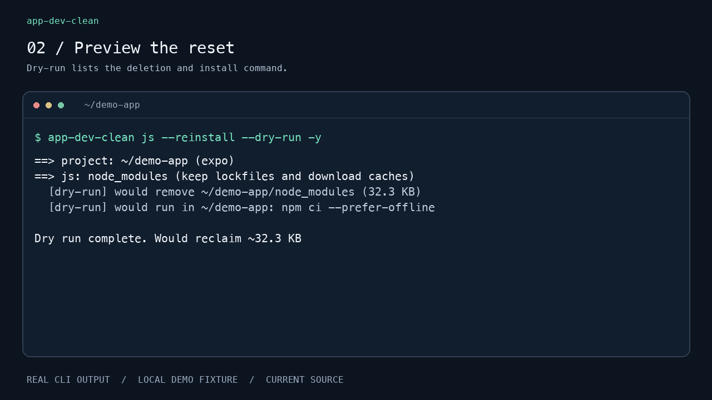
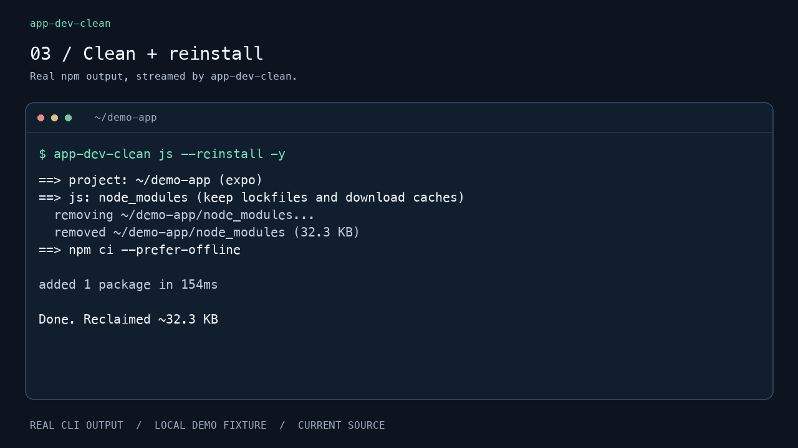

# Your first cleanup

[Back to the README](../README.md) · [Install](install.md) · [All commands](usage.md)

This tutorial uses the current source, including changes not yet in v0.1.0.
[Build from source](install.md#build-the-current-source) first. Use a project
you know, and stop development servers/builds before resetting their outputs.

## 1. Check the project

Open a terminal inside your app's project folder, then run:

```sh
app-dev-clean --version
app-dev-clean --root
```

The output shows the detected root and project type. You can also run from a
subdirectory; check that the resolved root is the one you intend to clean.
If no supported project is found, local cleanup stops.

## 2. Preview one operation

For React Native or Expo dependencies:

```sh
app-dev-clean js --reinstall --dry-run -y
```



The screenshot uses a tiny local Expo-shaped fixture, not a full app. On your
machine, paths, sizes, detected types, and the selected package manager will vary.
Dry-run does not delete files or execute cleanup/install commands. It can show
a command for a tool that is not installed; the real run checks required tools
before deletion.

For other projects, start with the corresponding preview:

| Project / goal | Preview command |
| --- | --- |
| Native Android build output | `app-dev-clean android --dry-run -y` |
| Flutter build output | `app-dev-clean flutter --dry-run -y` |
| Xcode / SwiftPM / Pods output | `app-dev-clean ios --dry-run -y` |
| Expo local state | `app-dev-clean expo --dry-run -y` |
| All supported local targets | `app-dev-clean local-all --dry-run -y` |

Review **every listed path and command**. Shared caches can affect other projects;
start with the narrow target related to your problem.

## 3. Run the reviewed operation

When you are ready to delete and reinstall JS dependencies:

```sh
app-dev-clean js --reinstall -y
```



The CLI validates the plan, removes the selected output, and runs the locked
install command. npm/pnpm/Yarn/Bun output appears directly in your terminal.
A lockfile is required for automatic reinstall. Missing tools, conflicting
lockfiles, or an incompatible pinned package-manager version stop this operation
before deletion.

Without `--reinstall`, `app-dev-clean js -y` removes `node_modules` and leaves
reinstallation to you. Do not remove `--dry-run` from an example until you intend
to perform its cleanup.

## 4. Check and resume

In a Git project, inspect your working tree:

```sh
git status --short
```

Then restart your normal build or development command. The demo renderer checks
that `package-lock.json` and `App.js` stay byte-for-byte unchanged. On real projects,
package install scripts and external build tools can have additional effects;
inspect those changes as you normally would.

If reinstall fails, the exit status is nonzero and the terminal shows the failing
command. Fix the underlying package/tool/network issue and retry that install
command from the directory shown. Cleanup is not transactional and does not roll
back removed dependencies.

## Prefer the menu?

Run `app-dev-clean --dry-run`, select targets with `Space`, then press `Enter`
to preview. `a` selects only local targets, `n` clears the selection, and `q`
quits. Run without `--dry-run` when ready to perform your selection.

See [scope, reinstall rules, and safety limits](usage.md) before using shared/global
targets or `nuclear`.
